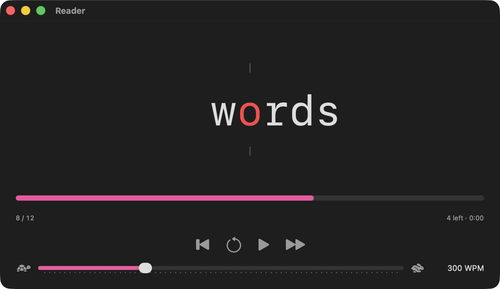
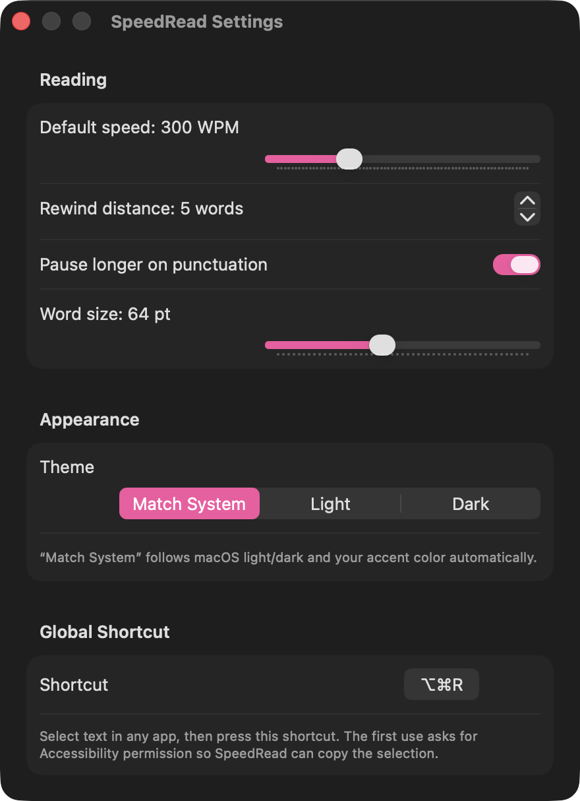

<div align="center">

# SpeedRead

**A native macOS speed reader.** Flash any text one word at a time, with the
focal letter pinned in place so your eyes never move.




</div>

SpeedRead uses **RSVP** (Rapid Serial Visual Presentation): instead of your eyes
sweeping across lines, words appear in a fixed spot at a speed you control. The
pivot letter (the Optimal Recognition Point, ~30% into each word) is tinted and
column‑locked so every word lands in the same place.

It's a local reimplementation of the
[rapid-reader-extension](https://github.com/ClaysonIO/rapid-reader-extension)
Chrome extension, rebuilt as a real Mac app with a system‑wide right‑click entry
and a global hotkey.

## Features

- **Reader** — one word at a time, pivot letter pinned; play/pause, rewind,
  restart, step, and a drag‑to‑seek progress bar.
- **Speed slider**, 100–800 WPM, adjustable live while it's playing.
- **Right‑click → Services → speedRead** on selected text in any app.
- **Global hotkey** (default ⇧⌥⌘T) — select text anywhere, press it, start reading.
- **Keyboard in the reader** — Space play/pause, ←/→ step, R restart.
- **Settings** (⚙️ in the window's top-right, or ⌘,) — default speed, rewind
  distance, punctuation pauses, word size, accent color, the hotkey, launch-at-login,
  and a **Background Service** toggle that keeps SpeedRead running after you close
  its window (with the global shortcut, menu bar icon, and right-click entry
  grouped under it).
- **Follows your system** — light/dark and accent color automatically, or pick a
  fixed theme and accent (any of the macOS accent colors).
- **No network** — text you read never leaves your Mac.

## Install

1. Download `SpeedRead-<version>.dmg` from the
   [latest release](../../releases/latest).
2. Open it and drag **SpeedRead** to **Applications**. *(The right‑click Service
   only registers from a standard Applications folder.)*
3. Launch it once.

Requires **macOS 14 or later**, Apple Silicon or Intel.

By default SpeedRead is a normal app — it's in the Dock and ⌘-Tab while a window
is open, and ⌘Q quits it. Turn on **Background Service** in Settings to have it
keep running after you close the window (out of the Dock, still listening for the
global shortcut and reachable from the menu bar ▶); then ⌘Q sends it to the
background instead of quitting, and a real quit is in the menu bar item.

### Permissions

- The **right‑click Service needs nothing** — macOS hands the selected text to the app.
- The **global hotkey** asks for **Accessibility** permission the first time, so it
  can copy the text you've highlighted in another app. Grant it in
  System Settings → Privacy & Security → Accessibility.
- If "speedRead" doesn't appear under right‑click → Services, enable it in
  System Settings → Keyboard → Keyboard Shortcuts → Services → Text (you can
  bind a system shortcut there too), or run
  `/System/Library/CoreServices/pbs -flush`.

## Usage

Three ways to start a reading session:

| | |
|---|---|
| **Paste** | Open SpeedRead, paste or type into the box, click **Speed Read**. |
| **Right‑click** | Select text in any app → right‑click → Services → **speedRead**. |
| **Hotkey** | Select text anywhere → press **⇧⌥⌘T**. |

<div align="center">

</div>

## Build from source

```sh
brew bundle          # installs xcodegen
make run             # generate project, build, launch
```

- `make project` — regenerate `SpeedRead.xcodeproj` from `project.yml`
- `make icon` — regenerate the app icon (`Tools/makeicon.swift`)
- `make package` — universal Release build + DMG into `dist/`
  (see `scripts/package.sh` for the signing/notarization env)

The Xcode project is generated by [XcodeGen](https://github.com/yonaskolb/XcodeGen)
and is **not** checked in — edit `project.yml` and the files under `Sources/`.

Releasing a signed, notarized build is documented in
[`RELEASE_CHECKLIST.md`](RELEASE_CHECKLIST.md).

## How it works

Text is normalized (dash spacing, footnote‑digit stripping — the same rules as the
upstream extension) and split on whitespace. Each word is shown for `60 / WPM`
seconds, stretched a little after commas and sentence endings when "pause on
punctuation" is on. The pivot index is a fixed function of word length; the word
is laid out as three equal‑width columns (before / pivot / after) in a monospaced
font so the pivot never shifts horizontally.

Credit to [ClaysonIO/rapid-reader-extension](https://github.com/ClaysonIO/rapid-reader-extension)
for the original — the RSVP approach and heuristics come from there.

## License

[MIT](LICENSE) © 2026 Cami Burger. The upstream extension is also MIT.
